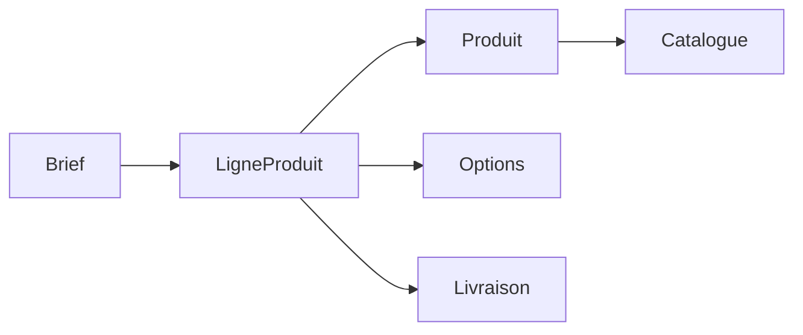

# 🛒 Composant métier — Prise de commande Trade

**Auteur :** Florian Harmel  
**Version :** 1.0  
**Date :** Octobre 2025  

---

## 🎯 Objectif

Permettre à un utilisateur métier (Trade / Retail / Marketing) de **créer un brief de commande** incluant :
- informations générales (nom, réseau, marque, date, commentaire, pièces jointes),
- **sélection de produits** issus d’un **catalogue** (onglets + recherche),
- ajout d’**articles hors catalogue**,
- configuration **options / livraison / installation**,
- **panier** récapitulatif avec **total estimatif**,
- envoi d’un **payload JSON standardisé** au back‑end (Xano).

---

## 🧭 Parcours & écrans (mapping des captures)

1. **Écran 1 – Formulaire “Nouveau brief”**  
   Champs : **Nom**, **Réseau (retailer)**, **Marque**, **Date de début**, **Commentaire**, **Fichiers de brief**.  
   CTA : **Ajouter des produits** → ouvre l’écran produits.

2. **Écran 2 – Sélection de produits**  
   - **Hors catalogue** : description libre + quantité + bouton **Ajouter le produit**.  
   - **Catalogue** : onglets par catalogue (ex. *All Trade*, *Galeries Lafayette*) + **recherche**.  
     Chaque carte propose **Quantité** + **Ajouter le produit** et un lien **Voir les prix**.

3. **Écran 3 – Modale “Voir les prix”**  
   Affiche la **grille tarifaire par paliers** (ex. *De 1 à 4* / *> 5*) pour la référence sélectionnée.

4. **Écran 4 – Détail d’une carte produit enrichie**  
   - **Méthode de livraison** (liste)  
   - **Installation à prévoir** (checkbox)  
   - **Options** (checkbox : *Insertion testeurs*, *Finition*, *Pelliculage*, …)  
   - **Tableau de ligne** avec quantité, options et **prix estimatif**, puis **Total estimatif** (produit + options + livraison).

5. **Écran 5 – Récap / Panier**  
   Liste des **Produits ajoutés** + **Total budget estimatif**.  
   CTA bas de page : **Valider la création d’un brief**.

6. **Workflow “On submit”**  
   Chaîne d’actions qui upload les fichiers, construit le payload, **POST /project**, reset les variables et redirige.

7. **Custom JS – Construction du payload JSON**  
   Code qui **agrège le panier** et mappe toutes les valeurs (brief, produits, options, livraison, identifiants) vers la **structure attendue** par l’API.

---

## 🧩 Cas particulier : Shiseido

Certaines marques, comme **Shiseido**, disposent d’un flux de commande simplifié et **déconnecté du calcul automatique** présent dans les autres projets.

### ⚙️ Particularités fonctionnelles
- Aucun calcul automatique des prix à partir des paliers.  
- Le **prix total** est déterminé via un **fichier Excel externe**, hébergé sur **SharePoint**.  
- Ce fichier est synchronisé et mis à jour par un **script Power Automate**, qui calcule les montants en fonction :
  - des quantités saisies dans WeWeb,  
  - des options sélectionnées,  
  - et des grilles tarifaires internes.  
- Le résultat est ensuite **intégré manuellement ou importé** côté back-office.  
- Le bouton **“Ajouter le produit”** ajoute simplement l’article au panier sans recalcul local.

### 🧭 Parcours utilisateur (Shiseido)
1. L’utilisateur saisit une **quantité** (ex. 20) et clique sur **Ajouter le produit**.  
   → Affichage du loader *“Mise à jour du panier en cours”*.  
2. Une **pastille rouge (badge)** apparaît sur l’icône panier.  
3. Le clic sur cette icône ouvre le **panier récapitulatif** :
   - Nom du projet, Marque, Retailer, Date, Commentaire.  
   - Liste des produits ajoutés avec :
     - Quantité,  
     - Prix unitaire avec options,  
     - Prix unitaire emballage + livraison,  
     - Prix PAO,  
     - Total ligne.  
   - Total budget estimatif avec livraison et options.  
4. CTA final : **“Validation Animation”** (équivalent du *submit*).  

### 🧮 Exemple d’affichage
```
BEAUTY HUB MIROIR GRAND MODÈLE - SHISEIDO  
Quantité : 20 ex  
Prix unitaire avec options : 49,59 €  
Prix unitaire emballage + livraison : N/D  
Prix PAO : 150 €  
Total : 1 471,07 €  
```

---

## 🔁 Fonction “Duplication de projet”

### ⚙️ Description
Depuis la fiche d’un projet existant (ex. **“Summer Pack M – S29”**), un bouton **“Dupliquer”** situé en haut à droite permet de **relancer automatiquement la création d’un nouveau brief** à partir du projet sélectionné.

### 🧭 Comportement attendu
- Le clic sur **“Dupliquer”** ouvre directement la page **Nouveau brief**.  
- Tous les champs du formulaire sont **préremplis** à partir du projet source :
  - Nom (suffixé ou non)
  - Réseau / Marque
  - Date d’animation
  - Liste des produits précédemment ajoutés (avec quantités, options, livraison…)
  - Commentaire éventuel
- L’utilisateur peut **modifier ou retirer des éléments** avant de valider la nouvelle commande.

### 🚫 Cas particulier Shiseido
> Pour le projet **Shiseido**, la duplication est actuellement **non fonctionnelle**.  
> Le chargement automatique des données du projet source n’est pas implémenté sur ce flux spécifique.  
> La création d’un nouveau brief se fait donc manuellement (aucun pré-remplissage).

---

## 📦 Payload JSON (forme cible)

> Construit via le **Custom JS**. Exemple de structure résultante :

```js
{
  variables: {
    name: "<nom_projet>",
    due: "<timestamp_date_debut>",
    client: "<client_id>",
    user_id: "<airtable_user_id>",
    brand: "<brand_id>",
    segment: "<segment_id>",
    retailer: "<retailer_id>",
    catalog: "<current_catalog_id or null>",
    type: "Trade",
    brief_attachment: { /* objet de fichier ou null */ },
    product_quots: [
      {
        name: "Podium Concept 2",
        id: "<product_id>",
        quantity: 12,
        options: ["Insertion testeurs - 4 maximum"],
        delivery_method: "Livraison Entrepôt",
        catalog_item: true,
        catalog: "All Trade",
        installation: false
      }
    ],
    offer_uuid: "<offer_uuid>",
    client_uuid: "<client_uuid>"
  }
}
```

**Construction d’une ligne (extrait de logique) :**
```js
products.push({
  name: item.name,
  id: item.id,
  quantity: item.quantity,
  options: item.catalog ? item.options.map(o => o.name) : [],
  delivery_method: item.catalog && item.delivery
    ? delivery_list_data.find(d => d.id === item.delivery)?.name || null
    : null,
  catalog_item: !!item.catalog,
  catalog: current_catalog?.name ?? null,
  installation: item.installation
});
```

---

## ⚙️ Workflow WeWeb — On submit (détaillé)

1. **Trade_order** *(workflow projet ; optionnel selon client)*  
2. `Post_project_is_fetching = true` *(affiche loader)*  
3. Mise à jour `createLoadingText` *(texte “création en cours… “)*  
4. **IF** : *fichier trop gros ?* → branchement vers message d’erreur / compression / annulation  
5. **Upload** : *get URL for brief file* → renvoie `brief_attachment`  
6. **POST /project** : envoi du **payload JSON**  
7. **Reset variable(s)** : `basketList`, `newProductList`, `Post_project_is_fetching`…  
8. **Navigate** → Dashboard / Confirmation

**En cas d’échec :** branche *On error* (toast utilisateur + log technique).

---

## ✅ Validations

- Champs **requis** (Nom, Réseau, Marque, Date).  
- Quantité **> 0**.  
- Gestion **taille max** fichier brief.  
- **Panier non vide** pour activer la validation.

---

## 🧠 Bonnes pratiques

- Charger la **grille de prix** à la demande (clic “Voir les prix”).  
- Centraliser la **construction du payload** dans un seul Custom JS.  
- Conserver `basketList` comme **source de vérité** du panier.  
- Afficher **N/D** et prévoir un contact commercial si un prix manque.  
- **Reset** propre des variables après succès + navigation.  
- Mentionner la version du projet dans la duplication pour traçabilité.

---

## 🧱 Schéma de données (simplifié)


